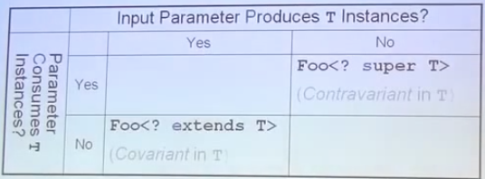

# Generics (31 a 33)

## Item 31: wildcards for api flexibility

Wildcard allow to write Flexible Apis, but why do we need wildcards?
Arrays in Java are covariant so if we have an Object[] and an String[], we can put the String[] inside of the Object[]

Arrays give us more flexibility but worse compile-time type safety.

* Unlike arrays, generics types are invariant

  - that is, a **`List<String>`** is not a subtype of **`List<Object>`**
  - Good for compile-time type safety, but inflexibility
  
- Wildcard types provide additional API flexibility

  - List<String> is a subtype of List<? extends Object>
  - List<Object>** is a subtype of List<? super String>
  
A Mnemonic for wildcards Usage

- PECS **Produce extends, Consumer super**  

  - For a T producer, use Foo<? extends T>
  - For a T consumer, use Foo<? super T>
  
  - means that:
   
    - when we passing in a parameter from which we want to **produce** **T**, we want to get **T's** from this thing. Then we should use the type **Foo<? extends T>** 
    - If we passing in a parameter into witch we want to put T's that is the thing that consumes elements of type T. then we should use Foo<? super T>

- Only applies wildcards to input parameters
  - don't use wildcards types as return types
  - would not make the API more flexibility
  - would force user to deal with wildcard types explicitly
  - User should not have to think about wildcards to use API  
  

In Summary in Tabular T instance:

  
  
## How to write A container with an Arbitrary Number of types parameters, 

For example a DataRow (of some database)?
The solution is the pattern: THC - Typesafe Heterogeneous Container pattern 

 - dont't parameterize the container
 - parameterize the selector
 
 - this way data is strongly typed at compile time
 - this way allows for unlimited type parameter

## Java Generics PECS – Producer Extends Consumer Super

[PECS Test ](../src/test/java/io/costax/chapter5/PECSTest.java)

##### Summary

Based on above reasoning and examples, let’s summarize our learning in bullet points.

1. Use the <? extends T> wildcard if you need to retrieve (GET) object of type T from a collection.

2. Use the <? super T> wildcard if you need to put (ADD) objects of type T in a collection.

3. If you need to satisfy both things, well, don’t use any wildcard. As simple as it is.

4. In short, remember the term PECS. Producer extends Consumer super. Really easy to remember.

That’s all for simple yet complex concept in generics in java. Let me know of your thoughts via comments.